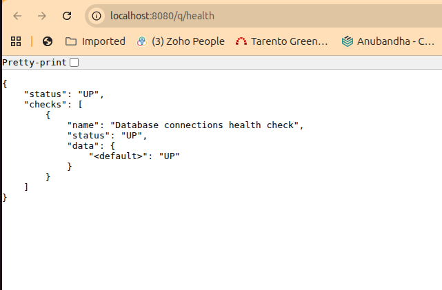
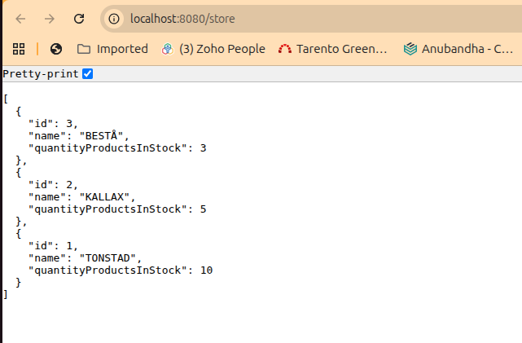
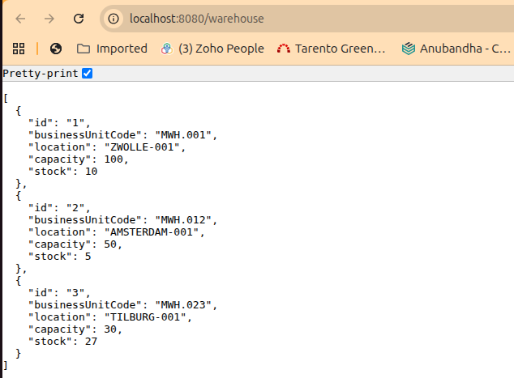
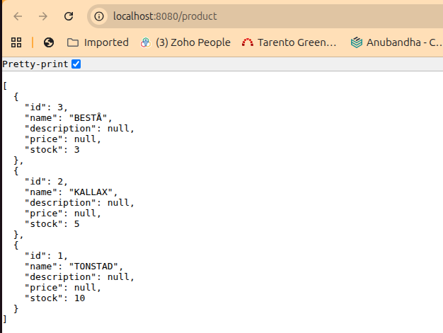
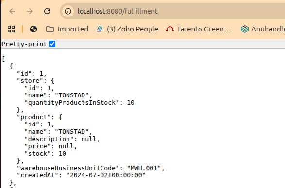
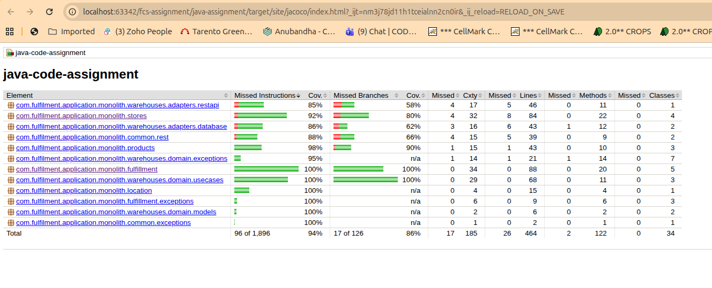

# Java Code Assignment

A Quarkus REST API for a simplified **Warehouse colocation management system** — the code
assignment portion of this repo. It explores API implementation, persistence, exception handling,
testing, and documentation across a small but non-trivial domain.

## Overview

Four entities make up the domain:

| Entity | Represents |
|---|---|
| `Location` | A geographical place (a city) where warehouses can be sited |
| `Store` | A physical store where `Products` are sold |
| `Warehouse` | A place where `Products` are kept before distribution to `Stores` |
| `Product` | A good sold to customers in a `Store` |

A `Warehouse` also supports **replacement**: creating a new warehouse in the same area as an
existing one, reusing its Business Unit Code, while the old one is archived (not deleted) so its
history is preserved. See [`../case-study/BRIEFING.md`](../case-study/BRIEFING.md) for the full
domain briefing.

Read [`CODE_ASSIGNMENT.md`](CODE_ASSIGNMENT.md) for the assignment tasks and
[`QUESTIONS.md`](QUESTIONS.md) for written answers to the accompanying design questions.

## Tech stack

Java 17 · Quarkus 3.13 · RESTEasy Reactive · Hibernate ORM with Panache · PostgreSQL ·
OpenAPI-generated REST contracts · JUnit 5 + Mockito + REST Assured · JaCoCo · Spotless
(Google Java Format)

## Project structure

```
src/main/java/com/fulfilment/application/monolith/
├── location/     Location lookups
├── stores/       Store CRUD (active-record) + CDI events for post-commit legacy sync
├── products/     Product CRUD (active-record)
├── warehouses/   create/replace/archive use cases, ports, validation, REST + DB adapters (hexagonal)
└── fulfillment/  Warehouse↔Store↔Product assignment (bonus feature), REST + DB adapters, validation
```

`stores`/`products` use Panache active-record entities directly from the REST layer (simplest for
plain CRUD); `warehouses` and `fulfillment` separate business-rule validation and orchestration
from persistence/REST adapters. See [`QUESTIONS.md`](QUESTIONS.md) for the reasoning behind the mix.

### Requirements

To compile and run this demo you will need:

- JDK 17+

In addition, you will need either a PostgreSQL database, or Docker to run one.

### Configuring JDK 17+

Make sure that `JAVA_HOME` environment variables has been set, and that a JDK 17+ `java` command is on the path.

## Building the demo

Execute the Maven build on the root of the project:

```sh
./mvnw package
```

## Running the demo

### Live coding with Quarkus

The Maven Quarkus plugin provides a development mode that supports
live coding. To try this out:

```sh
./mvnw quarkus:dev
```

In this mode you can make changes to the code and have the changes immediately applied, by just refreshing your browser.

    Hot reload works even when modifying your JPA entities.
    Try it! Even the database schema will be updated on the fly.

### (Optional) Run Quarkus in JVM mode

When you're done iterating in developer mode, you can run the application as a conventional jar file.

First compile it:

```sh
./mvnw package
```

Next we need to make sure you have a PostgreSQL instance running (Quarkus automatically starts one for dev and test mode). To set up a PostgreSQL database with Docker:

```sh
docker run -it --rm=true --name quarkus_test -e POSTGRES_USER=quarkus_test -e POSTGRES_PASSWORD=quarkus_test -e POSTGRES_DB=quarkus_test -p 15432:5432 postgres:13.3
```

Connection properties for the Agroal datasource are defined in the standard Quarkus configuration file,
`src/main/resources/application.properties`.

Then run it:

```sh
java -jar ./target/quarkus-app/quarkus-run.jar
```

    Have a look at how fast it boots.
    Or measure total native memory consumption...

## See the demo in your browser

Navigate to:

<http://localhost:8080/index.html>

Have fun, and join the team of contributors!

## API reference

All endpoints return/accept JSON. `Warehouse`'s shape is generated from
[`src/main/resources/openapi/warehouse-openapi.yaml`](src/main/resources/openapi/warehouse-openapi.yaml);
the others are hand-coded (see `QUESTIONS.md` for the trade-off discussion).

| Method | Path | Description |
|---|---|---|
| `GET` | `/store` | List all stores |
| `GET` | `/store/{id}` | Get a store by id |
| `POST` | `/store` | Create a store |
| `PUT` | `/store/{id}` | Replace a store's fields |
| `PATCH` | `/store/{id}` | Partially update a store |
| `DELETE` | `/store/{id}` | Delete a store |
| `GET` | `/product` | List all products |
| `GET` | `/product/{id}` | Get a product by id |
| `POST` | `/product` | Create a product |
| `PUT` | `/product/{id}` | Update a product |
| `DELETE` | `/product/{id}` | Delete a product |
| `GET` | `/warehouse` | List active (non-archived) warehouses |
| `GET` | `/warehouse/{id}` | Get a warehouse by id |
| `POST` | `/warehouse` | Create a warehouse |
| `DELETE` | `/warehouse/{id}` | Archive a warehouse |
| `POST` | `/warehouse/{businessUnitCode}/replacement` | Replace the active warehouse for a Business Unit Code |
| `GET` | `/fulfillment` | List fulfillment assignments (optionally filter by `storeId` or `warehouseBusinessUnitCode`) |
| `POST` | `/fulfillment` | Assign a warehouse as a fulfillment unit for a product at a store |
| `DELETE` | `/fulfillment/{id}` | Remove a fulfillment assignment |
| `GET` | `/q/health` | Liveness/readiness health check |

## Screenshots

Images live in [`docs/screenshots/`](docs/screenshots/).

**Health check** — `GET /q/health`



**Store list** — `GET /store`



**Warehouse list** — `GET /warehouse`



**Product list** — `GET /product`



**Fulfillment assignment list** — `GET /fulfillment`



<details>
<summary><h2>Sample requests & responses (click to expand)</h2></summary>

Captured from an actual run of the app (`java -jar target/quarkus-app/quarkus-run.jar` against a
seeded Postgres instance), so these are real request/response pairs, not hand-written examples.

**Health check**

```sh
curl -s http://localhost:8080/q/health
```

```json
{
  "status": "UP",
  "checks": [
    { "name": "Database connections health check", "status": "UP", "data": { "<default>": "UP" } }
  ]
}
```

**List seeded stores**

```sh
curl -s http://localhost:8080/store
```

```json
[
  { "id": 3, "name": "BESTÅ", "quantityProductsInStock": 3 },
  { "id": 2, "name": "KALLAX", "quantityProductsInStock": 5 },
  { "id": 1, "name": "TONSTAD", "quantityProductsInStock": 10 }
]
```

**Create a store**

```sh
curl -s -X POST http://localhost:8080/store -H "Content-Type: application/json" \
  -d '{"name":"README-DEMO-STORE","quantityProductsInStock":12}'
```

```
HTTP 201
{ "id": 4, "name": "README-DEMO-STORE", "quantityProductsInStock": 12 }
```

**Validation error (422) — `id` must not be set on create**

```sh
curl -s -X POST http://localhost:8080/store -H "Content-Type: application/json" \
  -d '{"id":1,"name":"SHOULD-FAIL","quantityProductsInStock":1}'
```

```
HTTP 422
{ "exceptionType": "jakarta.ws.rs.WebApplicationException", "code": 422, "error": "Id was invalidly set on request." }
```

**Not found (404)**

```sh
curl -s http://localhost:8080/store/999999
```

```
HTTP 404
{ "exceptionType": "jakarta.ws.rs.WebApplicationException", "code": 404, "error": "Store with id of 999999 does not exist." }
```

**Conflict (409) — deleting a Store still referenced by a fulfillment assignment**

```sh
curl -s -X DELETE http://localhost:8080/store/1
```

```
HTTP 409
{ "exceptionType": "io.quarkus.arc.ArcUndeclaredThrowableException", "code": 409, "error": "The request conflicts with existing data (e.g. a referenced record still exists)." }
```

**Replace a warehouse (reuses the same Business Unit Code, archives the old record)**

```sh
curl -s -X POST http://localhost:8080/warehouse/MWH.900/replacement -H "Content-Type: application/json" \
  -d '{"location":"AMSTERDAM-002","capacity":60,"stock":20}'
```

```
HTTP 200
{ "id": "5", "businessUnitCode": "MWH.900", "location": "AMSTERDAM-002", "capacity": 60, "stock": 20 }
```

**Cardinality conflict (409) — a Product already fulfilled by its max of 2 Warehouses per Store**

```sh
curl -s -X POST http://localhost:8080/fulfillment -H "Content-Type: application/json" \
  -d '{"storeId":1,"productId":1,"warehouseBusinessUnitCode":"MWH.023"}'
```

```
HTTP 409
{
  "exceptionType": "com.fulfilment.application.monolith.fulfillment.exceptions.MaxWarehousesPerProductPerStoreExceededException",
  "code": 409,
  "error": "Product 1 at store 1 is already fulfilled by the maximum of 2 warehouses"
}
```

</details>

## Testing and code coverage

See [TESTING.md](TESTING.md) for the testing strategy, how to run `./mvnw test`/`./mvnw verify`,
and how to view the JaCoCo coverage report. The suite was last measured at 94% instruction coverage,
well above the 80% gate enforced by `jacoco-maven-plugin:check` during `./mvnw verify` — re-run it
after pulling changes to confirm the current number.



## Troubleshooting

Using **IntelliJ**, in case the generated code is not recognized and you have compilation failures, you may need to add `target/.../jaxrs` folder as "generated sources".

## Related docs

- [`CODE_ASSIGNMENT.md`](CODE_ASSIGNMENT.md) — the assignment tasks
- [`QUESTIONS.md`](QUESTIONS.md) — written answers to the design/trade-off questions
- [`TESTING.md`](TESTING.md) — testing strategy and coverage
- [`../case-study/BRIEFING.md`](../case-study/BRIEFING.md) — domain briefing
- [`../case-study/CASE_STUDY.md`](../case-study/CASE_STUDY.md) — business case study scenarios
- [`../CONTRIBUTING.md`](../CONTRIBUTING.md) — contribution guidelines
